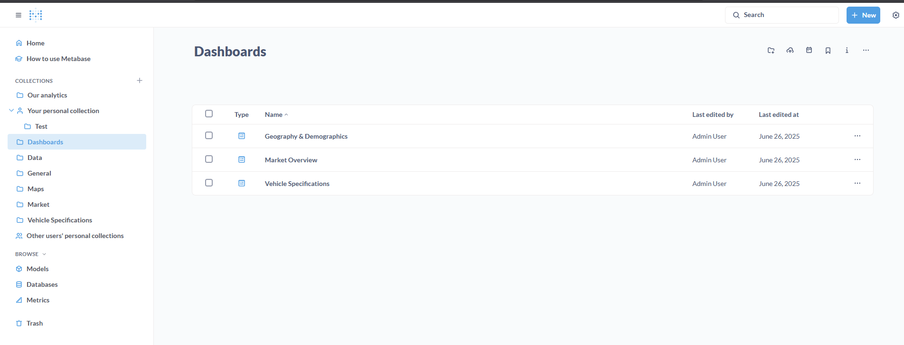

# Otomoto Statistics Dashboard

A data engineering and analytics project for collecting, parsing, and analyzing car listings from [otomoto.pl](https://www.otomoto.pl/).  
It provides tools for scraping, parsing, storing, and exploring automotive market data, with a focus on robust batch processing and PostgreSQL integration.


# Features

- **Automated Data Collection**: Scrapes car listings and details from otomoto.pl using custom scripts and proxy support.
- **PostgreSQL Storage**: Stores raw and parsed data in a normalized, partitioned PostgreSQL schema.
- **Extensible Parsers**: Modular parser classes for summary, details, and price extraction.
- **Proxy Management**: Includes utilities for finding and testing free proxies.
- **Metabase Dashboards**: 

# Prerequisites
- #### Python 3.8+
- #### Docker & Docker Compose

# Setup

### 1. Clone the Repository

```bash
cd <desired-directory>
git clone <repo-url>
```
### 2. Run venv and install Python Dependencies
```bash
python -m venv venv

venv\Scripts\activate

pip install -r requirements.txt
```

### 3. Unpack base.zip
Since I wanted to supply the data i scraped, there is one larger postgres file which needs to be unpacked. It can be found here: [base.zip](data/postgres/base.zip).    
Go ahead and **unpack it in the same directory** it's already in.

### 4. Start docker
You need to have docker installed and running.  
It will automatically set up the PostgreSQL and metabase with data from [/data](data) folder.
```bash
docker-compose up
```
        
# Docker
Mainly used start and stop for which there are scripts found in [/docker_services](scripts/build/docker_services) that start or stop all services.   

Start:
```bash
python .\scripts\build\docker_services\startServices.py 
```

Stop:
```bash
python .\scripts\build\docker_services\stopServices.py 
```     

# PostgreSQL
Database tables are created by .sql files found in [/config/postgres](config/postgres).     

To rebuild the database when there is a new .sql file you can run [rebuildPgDb](scripts/build/docker_services/rebuildPgDb.py) which will either:
1. Rebuild from existing dump (Option 1)
2. Rebuild with current data (Option 2). It will also create a dump file in [/backups](backups) directory.  
# Dashboards
For this project I used Metabase mainly because it is lightweight and provides enough tools to build insightful dashboards.     

### **Ensure that metabase service is running in docker** 
If there are issues just restart the services using:
```bash
docker-compose down
docker-compose up
```

### **Accessible at: `localhost:3000`**
**Login:** `localhost@local.com`  
**Password:** `zaq1@WSX`  

Dashboards can be found here:
   
# Scraping
Main tool for scraping the website is scrapy. There are custom middlewares which control headers and proxy and rotate if needed.

- **Proxy**: To add a proxy you need to change the name of [.env.secrets](.env.secrets.example) file to ".env.secrets" and put your proxy address there. (Only one proxy address is supported but it can be easily adjusted to use multiple).
There are 3 middlewares for proxies found in [middlewares.py](scripts/collectors/scraper/scraper/middlewares.py):   
1. **StickyProxyMiddleware**: generates a sticky proxy address from existing proxy address found in .env.secrets (will only work with BrightData proxy address)    
2. **FreeProxyMiddleware**: collects free proxies from links provided in [FreeProxyUtil](scripts/utils/FreeProxyUtil.py), tests them asynchronously against https://httpbin.org/ip and returns valid ones (not reliable but 1 in 20 tries should work)      
3. **RandomProxyMiddleware**: sets spider's proxy to that set in .env.secrets

- **Headers**: Generated automatically in [middlewares.py](scripts/collectors/scraper/scraper/middlewares.py) by **UAGeneratorMiddleware** which is based on "ua_generator" module. Will refresh on status 403 and 429.

### 1. Website scraping
There are 3 spiders. 
- [listing_spider](scripts/collectors/scraper/scraper/spiders/listing_spider.py) for scrpaing listing e.g. https://otomoto.pl/bmw. Uses **StickyProxyMiddleware**.
- [details_spider](scripts/collectors/scraper/scraper/spiders/details_spider.py) for scraping ads found by listing spider. Uses **RandomProxyMiddleware**.
- [middleware_test](scripts/collectors/scraper/scraper/spiders/middleware_test_spider.py) only used for testing middlewares against https://httpbin.org/
```bash
cd .\scripts\collectors\scraper\

scrapy crawl listing # Scraping listing with brief information
# or
scrapy crawl details # Scraping details from ids scraped in listing spider
```

# Parsing
(There is no details parsing implemented because i ran out of freemium proxy credits 😞)    
Parsing is done once all listings needed are scraped.   
Parsers can be found in [/parsers](scripts/parsers) directory.

**Arguments:**  
- **--parser-type:** string (summary/details/price)
- **--only-missing:** boolean (if used then only missing ids will be parsed)
- **--batch-size**: integer (default 1000)

### Example usage:
```bash
python .\scripts\build\data_services\parseRawListing.py --parser-type price --only-missing --batch-size 200
```